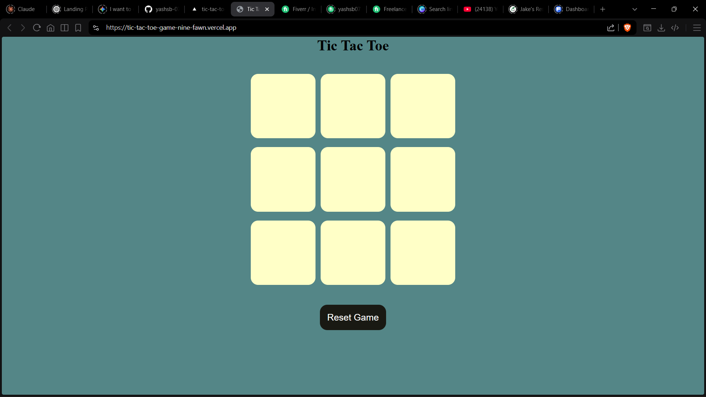
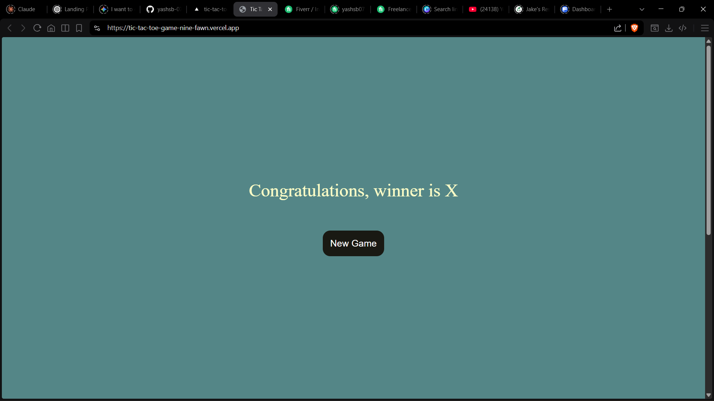

# 🎮 Tic Tac Toe Game

A simple and interactive **Tic Tac Toe** game built using **HTML, CSS, and JavaScript**. Play with a friend locally and enjoy a clean, responsive UI.

  
  
  
  
  
 

## 🚀 Live Demo

👉 https://tic-tac-toe-game-nine-fawn.vercel.app

---

## ✨ Features

* 🎯 Two-player gameplay (X vs O)
* 🔄 Reset and New Game functionality
* 🏆 Winner announcement display
* 💡 Simple and clean UI
* 📱 Responsive design using `vmin` units

---

## 🛠️ Tech Stack

* **HTML5** – Structure
* **CSS3** – Styling and layout
* **JavaScript (Vanilla JS)** – Game logic

---

## 📂 Project Structure

```
📁 tic-tac-toe
│── index.html
│── style.css
│── app.js
```

---

## 🧠 How It Works

* The game board consists of 9 buttons.
* Players take turns marking **O** and **X**.
* The game checks for winning patterns after every move.
* When a player wins:

  * A message is displayed 🎉
  * All boxes are disabled

---

## 📸 Screenshots
🕹️ Game Board



🏆 Winner Screen

---

## ⚙️ Setup & Run Locally

1. Clone the repository:

   ```bash
   git clone https://github.com/your-username/tic-tac-toe.git
   ```

2. Open the project folder:

   ```bash
   cd tic-tac-toe
   ```

3. Open `index.html` in your browser

---

## 📌 Future Improvements

* 🤖 Add AI (Play vs Computer)
* 🎨 Improve UI/animations
* 🔊 Add sound effects
* 🌐 Multiplayer (online)

---

## 🙌 Acknowledgements

This project was built as a beginner-friendly practice to strengthen JavaScript fundamentals.

---

## 📬 Contact

If you liked this project, feel free to connect or give it a ⭐ on GitHub!

---
